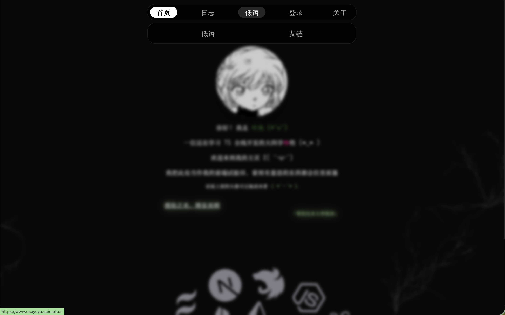

# yeyu-blog

个人开发的全栈博客项目，部署在 Vercel。

博客地址：[叶鱼 | 业余](https://www.useyeyu.cc)

> 国内访问速度不确定，可能需要网络环境支持。

## 功能

- 前台：主页、博客、笔记、低语、友链、关于、主题切换
- 内容：Markdown 渲染、代码高亮、标签分类、评论与回复
- 后台：博客、笔记、标签、引用、低语、友链、评论管理
- 登录：Better Auth、GitHub OAuth、Google OAuth、SIWE 钱包登录
- 上传：UploadThing 图片上传

## 技术栈

- Next.js 16 / React 19 / TypeScript 6
- Tailwind CSS 4 / shadcn/ui / Radix UI / Motion
- Better Auth / Wagmi / Viem / SIWE
- Prisma 7 / PostgreSQL / `@prisma/adapter-pg`
- TanStack Query / TanStack Table / Zustand
- UploadThing / Shiki / Unified / Remark / Rehype
- Biome / Husky / Commitizen

## 截图展示




## 本地运行

确保你已安装：

- Git
- pnpm
- Node.js >= 20
- PostgreSQL 数据库，使用本地数据库、Neon 或 Vercel Storage 都可以

### 获取项目代码

先 fork 仓库到你自己的账号，再 clone 你 fork 后的仓库：

```shell
git clone {REPO}
```

### 安装依赖

```shell
pnpm install
```

### 配置环境变量

复制一份环境变量文件：

```shell
cp .env.example .env
```

按 `.env.example` 填写下面这些变量：

```env
SITE_URL=http://localhost:3000
NEXT_PUBLIC_SITE_URL=http://localhost:3000

BETTER_AUTH_SECRET=
BETTER_AUTH_URL=http://localhost:3000

NEXT_PUBLIC_ADMIN_EMAILS="example@gmail.com"
NEXT_PUBLIC_ADMIN_WALLET_ADDRESS=""

GITHUB_CLIENT_ID=
GITHUB_CLIENT_SECRET=
GOOGLE_CLIENT_ID=
GOOGLE_CLIENT_SECRET=

UPLOADTHING_TOKEN=
DATABASE_URL=

SMTP_HOST=
SMTP_PORT=465
SMTP_SECURE=true
SMTP_USER=
SMTP_PASS=
MAIL_FROM="叶鱼博客 <notice@example.com>"
MAIL_TO=
```

Gmail 应用专用密码可以不写空格，代码发送前也会自动移除空白。

`BETTER_AUTH_SECRET` 可以用下面的命令生成：

```shell
openssl rand -base64 32
```

当前服务端环境变量校验要求 GitHub 和 Google 两组 OAuth 都填写。`NEXT_PUBLIC_ADMIN_WALLET_ADDRESS` 是可选项，不需要钱包登录后台时可以留空。`MAIL_TO` 是站长通知收件人，多个邮箱用英文逗号分隔。

### 配置数据库

项目使用 PostgreSQL。创建数据库后，把连接地址填到 `DATABASE_URL`。

初始化数据库表：

```shell
pnpm exec prisma migrate dev --config ./prisma/prisma.config.ts
```

### 配置 OAuth

GitHub OAuth App：

- Homepage URL：`http://localhost:3000`
- Authorization callback URL：`http://localhost:3000/api/auth/callback/github`

Google OAuth Client：

- Authorized JavaScript origins：`http://localhost:3000`
- Authorized redirect URI：`http://localhost:3000/api/auth/callback/google`

部署到线上时，把上面的 `localhost` 替换成你的线上域名。

### 配置图片上传

前往 [UploadThing](https://uploadthing.com/) 创建 app，把 API Token 填到：

```env
UPLOADTHING_TOKEN=
```

### 启动开发服务

```shell
pnpm dev
```

前台地址：`http://localhost:3000`

后台地址：`http://localhost:3000/admin`

## 部署

推荐部署到 Vercel。部署前确认：

- Vercel 环境变量已按 `.env.example` 配置完整
- 线上数据库已经执行过 Prisma migration
- GitHub / Google OAuth callback URL 已改成线上域名
- `SITE_URL`、`NEXT_PUBLIC_SITE_URL`、`BETTER_AUTH_URL` 都是线上站点地址

## 修改网站信息

- `config/seo/index.ts`：站点 metadata 和 SEO 信息
- `config/env/server-env.ts`、`config/env/client-env.ts`：服务端和客户端环境变量校验
- `config/img/avatar.webp`：首页头像图片
- `ui/(main)/(home)/bio-section.tsx`：首页个人简介
- `ui/(main)/about/index.tsx`：关于页内容
- `ui/(main)/layout/contact-me/index.tsx`：底部联系方式
- `ui/(main)/(home)/tech-stack.tsx`：首页技术栈展示
- `lib/core/auth/guard.ts`、`lib/core/auth/utils.ts`：后台管理员权限判断
- `ui/components/modal/main/login-modal/index.tsx`：登录弹窗

## 设计参考

- [fuxiaochen](https://github.com/aifuxi/fuxiaochen)
- [Shiro](https://github.com/Innei/Shiro)
- [Arthals' Ink](https://arthals.ink/)
- [grtblog](https://github.com/grtsinry43/grtblog)
- [Arthals-Ink](https://github.com/zhuozhiyongde/Arthals-Ink)
- [Anthony Fu](https://antfu.me/)
- [Victor Williams](https://www.victorwilliams.me/)
- [Vercel Fonts](https://vercel.com/font)
